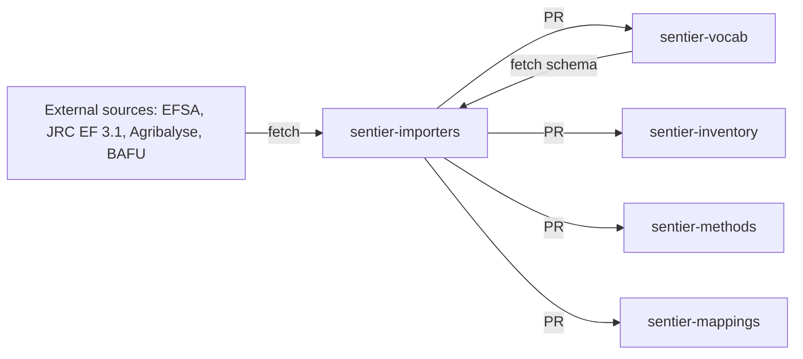

# sentier-importers



## What it is

A plugin framework that imports external data into the Sentier data repos. Each data source is a plugin. The framework runs every plugin through one staged pipeline:


- The framework owns the driver and the shared services: cached fetch, parsers, dedup, LinkML validation, YAML/JSON/Parquet writers, PR delivery.
- A source declares itself in `app/sentier_importers/registry.yaml` and implements `transform` in `app/sentier_importers/sources/<name>/source.py`.

## Install

Needs Python 3.10 or newer and `uv`.

```bash
uv sync --extra dev
```

## Use

List registered sources, their targets, and whether they are enabled:

```bash
uv run sentier-importers list
```

Run one source as a dry run. Files land in `output/<target>/<category>/`, no PR is opened:

```bash
uv run sentier-importers run <source>
```

`validate <source>` runs the same pipeline up to the validate step and emits nothing.

Options for `run`. The last three rows also apply to `validate`:

| Option | Effect |
|---|---|
| `--all` | run every enabled source instead of one; this is the CI smoke test |
| `--deliver` | also open a PR on the target repo; needs an authenticated `gh` |
| `--deliver-local <path>` | copy the emitted files into a local checkout of the target; no git, no PR |
| `--offline` | fail on any fetch cache miss |
| `--cache-dir`, `--output-dir` | override the fetch cache and the staging dir |
| `--schema-dir` | validate against local schemas instead of the target's pinned ref |

## Layout

```
app/sentier_importers/
  registry.yaml    the source registry, one commented block per source
  core/            pipeline driver, fetch, parse, dedup, validate, write, deliver, targets
  matching/        BAFU to EF flow matching, used by the bafu and eaternity sources
  sources/         one folder per source, example_csv/ is the reference plugin
scripts/           local BAFU regeneration driver and output checks
tests/             core/ framework tests, sources/ plugin tests
```

## Data

- Inputs: `file://` and `http(s)://` URLs. Fetches are cached in the user cache dir, `~/.cache/sentier_importers/` on Linux, keyed by the SHA-256 of the URL.
- Outputs: YAML or JSON for vocabulary terms, Parquet for bulk tables, randonneur JSON for mappings. Never TTL.
- Most sources are `enabled: false`. Big imports are opt-in so `run --all` stays fast.
- The Agribalyse, EF and BAFU sources read local `file://` paths. They only run where those files exist.

## Contributing

1. Add `app/sentier_importers/sources/<name>/source.py` with a `Source` subclass that implements `transform`. Override `fetch` or `parse` only if the input needs it.
2. Add a block to `registry.yaml`.
3. Add tests under `tests/sources/` with a cached fetch fixture. Tests run offline.

Format and test before committing:

```bash
uv run --extra dev pre-commit run --all-files
```

```bash
uv run --extra testing pytest
```

CI also runs the plugin tests with `uv run --extra testing pytest app/sentier_importers/sources/`.

## Licence

BSD 3-Clause. See `LICENSE`.
